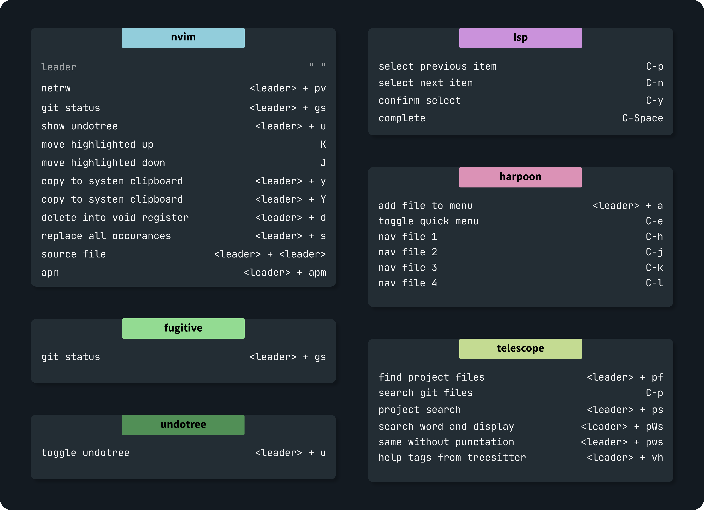

# nvim.daykoo
### Prerequisite:
`ripgrep`

### stack
* [lazy.nvim](https://github.com/folke/lazy.nvim) as plugin manager

#### Plugins
* [apm](https://github.com/ThePrimeagen/vim-apm) actions per minute
* [fugitive](https://github.com/tpope/vim-fugitive) git plugin
* [harpoon](https://github.com/ThePrimeagen/harpoon) great file changing
* [telescope](https://github.com/nvim-telescope/telescope.nvim) fuzzy finder
* [treesitter](https://github.com/nvim-treesitter/nvim-treesitter) parser and highlighting
* [undotree](https://github.com/mbbill/undotree) to revert changes easily

**lsp:**  
* [mason](https://github.com/williamboman/mason.nvim) lsp mangager
* [mason-lspconfig](https://github.com/williamboman/mason-lspconfig.nvim) for nvim-lspconfig 
* [cmp](https://github.com/hrsh7th/nvim-cmp) completion 
* [luasnip](https://github.com/L3MON4D3/LuaSnip) snippet engine 
* [cmd luasnip](https://github.com/saadparwaiz1/cmp_luasnip) completion source

### remaps
vim remaps can be found [here](/lua/daykoo/remap.lua)  
plugin remaps can be found in the corresponding plugin.lua file

### TODO:
- [ ] colorscheme
- [ ] toggle line comment
- [ ] some lsp stuff 
- [ ] for sure some remaps
- [ ] maybe an alternative for netrw
