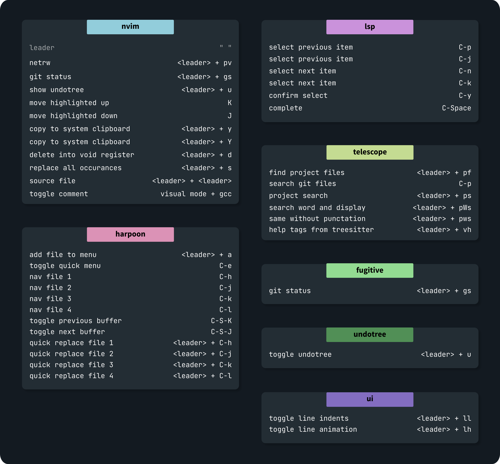

# nvim.daykoo
### Prerequisite:
`ripgrep`

### stack
* [lazy.nvim](https://github.com/folke/lazy.nvim) as plugin manager

#### Plugins
* [fugitive](https://github.com/tpope/vim-fugitive) git plugin
* [harpoon](https://github.com/ThePrimeagen/harpoon) great file changing
* [telescope](https://github.com/nvim-telescope/telescope.nvim) fuzzy finder
* [treesitter](https://github.com/nvim-treesitter/nvim-treesitter) parser and highlighting
* [undotree](https://github.com/mbbill/undotree) to revert changes easily
* [comment](https://github.com/numToStr/Comment.nvim) incredible and easy comment plugin that support motions
* [autotag](https://github.com/windwp/nvim-ts-autotag) auto closing tags for web dev 
* [ibl](https://github.com/lukas-reineke/indent-blankline.nvim) indent blank line visual

**lsp:**  
* [mason](https://github.com/williamboman/mason.nvim) lsp mangager
* [mason-lspconfig](https://github.com/williamboman/mason-lspconfig.nvim) for nvim-lspconfig 
* [cmp](https://github.com/hrsh7th/nvim-cmp) completion 
* [luasnip](https://github.com/L3MON4D3/LuaSnip) snippet engine 
* [cmp luasnip](https://github.com/saadparwaiz1/cmp_luasnip) completion source

**optional:**
* [nvim-tree](https://github.com/nvim-tree/nvim-tree.lua) file explorer as alternative to netrw, see [config](/lua/daykoo/lazy/nvimtree.lua) notes to activate

### remaps
vim remaps can be found [here](/lua/daykoo/remap.lua)  
plugin remaps can be found in the corresponding plugin.lua file

### TODO:
- [ ] code refactoring stuff 
- [ ] debugger
- [ ] cmp description buffer theme
- [ ] lsp error messages
- [ ] toggle cmp
