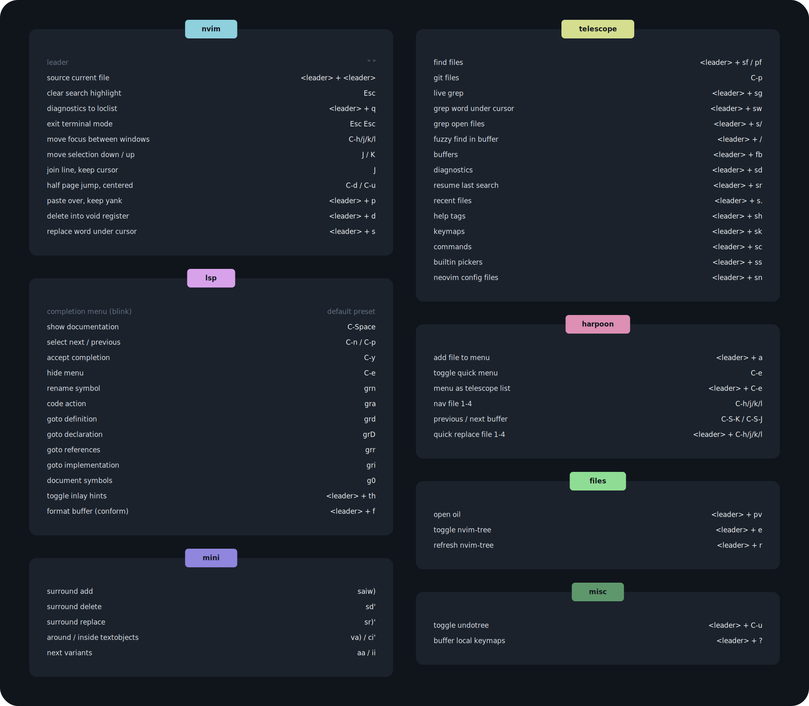

# daykoo.nvim
This configuration is my (currently) perfect setup for Neovim![^disclaimer]\
Required version since tree-sitter plugin is not maintained anymore: `0.12`.

## Features & Plugins
**Navigation**
- [telescope.nvim](https://github.com/nvim-telescope/telescope.nvim) fuzzy finder
- [harpoon2](https://github.com/ThePrimeagen/harpoon/tree/harpoon2) quick and easy navigation between files
- [oil.nvim](https://github.com/stevearc/oil.nvim) file explorer as neovim buffer
- [nvim-tree](https://github.com/nvim-tree/nvim-tree.lua) file explorer sidebar

**LSP & Autocompletion:**
- [blink.cmp](https://github.com/Saghen/blink.cmp) completion and snippets
- [conform.nvim](https://github.com/stevearc/conform.nvim) formatting
- [nvim-lspconfig](https://github.com/neovim/nvim-lspconfig) LSP configuration collection
    - [mason.nvim](https://github.com/mason-org/mason.nvim) LSP package manager
    - [mason-lspconfig.nvim](https://github.com/mason-org/mason-lspconfig.nvim) mason extension to combine mason and lspconfig

**UI & UX:**
- [nvim.mini](https://github.com/nvim-mini/mini.nvim) a collection of small independent plugins
    - [mini.icons](https://github.com/nvim-mini/mini.icons) icon provider
    - [mini.statusline](https://github.com/nvim-mini/mini.statusline) minimal and fast statusline
- [tokyonight.nvim](https://github.com/folke/tokyonight.nvim) the theme
- [fidget.nvim](https://github.com/j-hui/fidget.nvim) provides the LSP progress UI

**Quality of Live**:
- [nvim.mini](https://github.com/nvim-mini/mini.nvim) a collection of small independent plugins
    - [mini.ai](https://github.com/nvim-mini/mini.ai) extend and create `a/i` textobjects
    - [mini.surround](https://github.com/nvim-mini/mini.surround) surround actions
- [which-key.nvim](https://github.com/folke/which-key.nvim) shows keybindings in a popup while typing

## Required Packages
`ripgrep`\
`lua5.1`\
`make`\
`tree-sitter-cli`

## Keymaps

## Misc
If the syntax highlighting is missing try to run `:TSInstall <lang>`.

Big thanks to `@tjdevries` for his great tutorials and its work on `telescope` and the best neovim starting point in the world [kickstart.nvim](https://github.com/nvim-lua/kickstart.nvim) as well as `@ThePrimeagen` for providing nice keymaps and showing Neovim to the world.

[^disclaimer]: The best thing is that I didn't even use AI to write those dotfiles!
